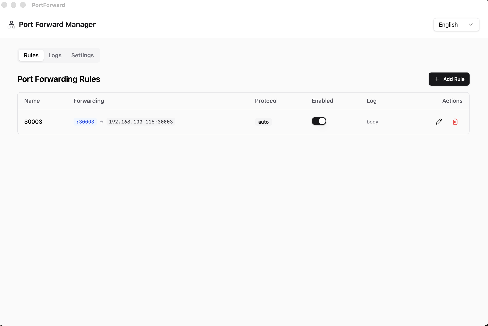
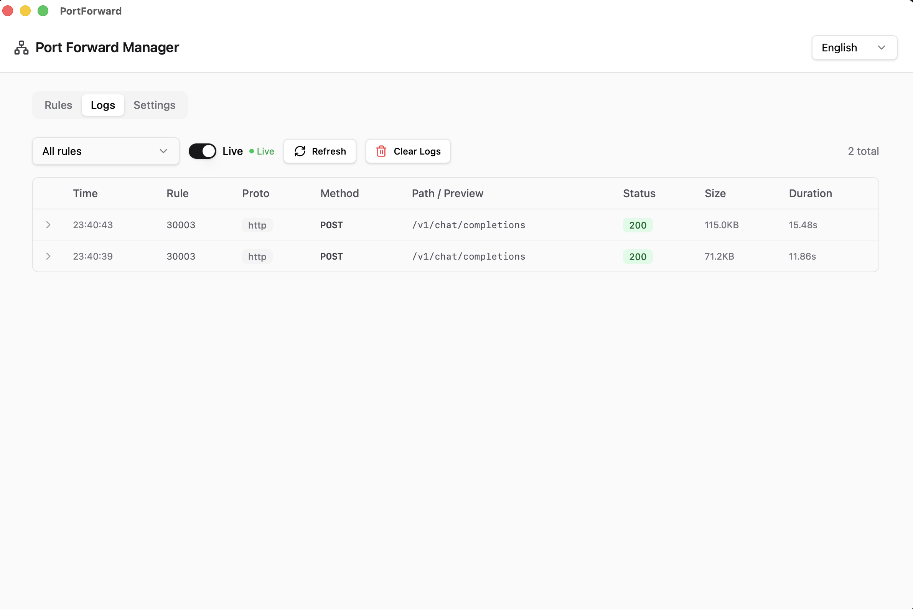

# Port Forward Manager

**[English](README.md)**

本地端口转发工具，带有 Web UI 和桌面客户端。  
将本地端口绑定后，把所有 TCP 连接转发到可配置的远程主机:端口。  
HTTP 流量自动检测并进行反向代理，支持完整的请求/响应日志记录。

## 截图





## 功能特性

- **规则管理** — 通过浏览器或桌面 UI 创建、编辑、删除和切换转发规则
- **协议自动检测** — 窥探前 8 字节区分 HTTP 与原始 TCP；也可手动指定 `http` / `tcp` 模式
- **HTTP 反向代理** — 完整记录 HTTP 流量的请求头、响应头和请求体/响应体，支持 SSE 实时推流
- **TCP 中继** — 双向原始 TCP 转发，记录字节数和耗时
- **日志查看器** — 分页请求日志表格，支持按规则过滤、SSE 实时模式和可展开的详情行
- **设置** — 在 UI 中配置日志保留策略（最大条数 + TTL 天数）及新建规则的默认属性
- **桌面客户端** — 通过 Tauri v2 在 macOS / Windows / Linux 上运行原生窗口（内嵌服务器，无需独立进程）
- **国际化** — 界面支持中文和英文，语言偏好通过 localStorage 持久化

## 架构

```
┌─────────────────────────────────────────────────────┐
│  Tauri 桌面端（可选）      │  浏览器（服务器模式）    │
│  webview → http://127.0.0.1:<随机端口>               │
└──────────────────┬──────────────────────────────────┘
                   │ HTTP
     ┌─────────────▼──────────────┐
     │   Axum API 服务器           │  :8080（可配置）
     │   GET/POST/PUT/DELETE       │
     │   /api/rules               │
     │   /api/logs  + SSE 流      │
     │   /api/settings            │
     │   /* （SPA，rust-embed）    │
     └─────────────┬──────────────┘
                   │ SQLite (sqlx)
     ┌─────────────▼──────────────┐
     │   代理管理器                │
     │   每规则独立 TcpListener    │
     │   HTTP → hyper 反向代理    │
     │   TCP  → 双向中继           │
     └────────────────────────────┘
```

- **后端**：Rust + Axum + sqlx (SQLite) + tokio
- **前端**：React 19 + TypeScript + Vite + Tailwind CSS v4 + shadcn/ui 组件
- **桌面端**：Tauri v2 — 进程内内嵌 Axum 服务器，webview 连接随机本地端口

## 快速开始

### 服务器模式（命令行）

**前置条件**：Rust 工具链（`rustup`）、Node.js ≥ 20

```bash
# 1. 构建前端（输出到 web/）
make frontend

# 2. 启动（默认：DB_PATH=portforward.db，LISTEN_ADDR=0.0.0.0:8080）
cargo run --release

# 打开 http://localhost:8080
```

环境变量：

| 变量 | 默认值 | 说明 |
|---|---|---|
| `DB_PATH` | `portforward.db` | SQLite 数据库文件路径 |
| `LISTEN_ADDR` | `0.0.0.0:8080` | API + UI 监听地址 |
| `RUST_LOG` | `info` | 日志级别（`debug`、`info`、`warn`、`error`） |

### 桌面客户端

**前置条件**：Rust 工具链、Node.js ≥ 20、`cargo install tauri-cli --version '^2' --locked`

Linux 额外需要：
```bash
sudo apt-get install -y libwebkit2gtk-4.1-dev libayatana-appindicator3-dev \
  librsvg2-dev patchelf build-essential libssl-dev
```

```bash
# 开发模式（热重载）
make desktop-dev

# 打包当前平台安装包
make desktop-build
# macOS  → target/release/bundle/dmg/  和  target/release/bundle/macos/
# Linux  → target/release/bundle/deb/  和  target/release/bundle/appimage/
# Windows → target/release/bundle/msi/
```

桌面客户端将数据库存储在系统应用数据目录：
- **macOS**：`~/Library/Application Support/com.portforward.app/portforward.db`
- **Windows**：`%APPDATA%\com.portforward.app\portforward.db`
- **Linux**：`~/.local/share/com.portforward.app/portforward.db`

## 构建命令参考

```bash
make frontend       # 构建 React → web/
make backend        # cargo build --release
make build          # frontend + backend

make dev            # 前端开发服务器（5173）+ 后端（8080）并行启动
make desktop-dev    # Tauri 开发窗口
make desktop-build  # Tauri 生产打包

make clean          # 删除 web/ dev.db target/
```

## API

| 方法 | 路径 | 说明 |
|---|---|---|
| `GET` | `/api/rules` | 列出所有规则 |
| `POST` | `/api/rules` | 创建规则 |
| `PUT` | `/api/rules/:id` | 更新规则 |
| `DELETE` | `/api/rules/:id` | 删除规则 |
| `POST` | `/api/rules/:id/toggle` | 切换启用状态 |
| `GET` | `/api/logs` | 分页请求日志（`rule_id`、`page`、`page_size`） |
| `DELETE` | `/api/logs` | 清空日志（可选 `rule_id` 查询参数） |
| `GET` | `/api/logs/stream` | SSE 实时请求日志流 |
| `GET` | `/api/settings` | 获取设置 |
| `PUT` | `/api/settings` | 更新设置 |

## 开源协议

MIT — 详见 [LICENSE](LICENSE)
